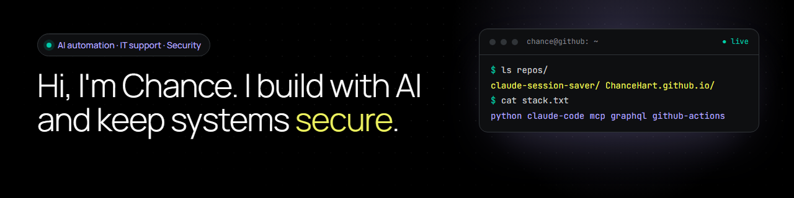

  

  
  
  

I build practical tools with AI and care about doing it safely. I use **Claude Code** as my pair programmer to write automations, connect tools through APIs and ship working software. Before tech, I fixed problems in the field and handled sensitive client data, so I like systems that are careful, documented and tested.

**Focus:** AI automation · IT support · security

## ⭐ Featured

| Project | What it is | Highlights |
|---|---|---|
| **[claude-session-saver](https://github.com/ChanceHart/claude-session-saver)** | A Claude Code hook that gives your AI agent a memory: every session saved as a searchable Markdown note | One-command install · secret redaction · 24 tests · CI on Windows, macOS, Linux |
| **[ChanceHart.github.io](https://github.com/ChanceHart/ChanceHart.github.io)** | My portfolio: case studies, real code and a working terminal | Hand-coded HTML/CSS/JS · strict Content-Security-Policy · no trackers |

## 🧰 Stack

`Python` · `Claude Code` · `MCP` · `GraphQL` · `GitHub Actions` · `unittest` · `HTML / CSS / JS` · `Git` · `Windows` · `Obsidian`

## 🔒 How I work

- **Check everything.** AI writes fast and sometimes writes wrong. I read it, test it and only ship what works.
- **Share less data.** Tools get only the data they need; personal information stays out of logs and public pages.
- **Automate the repeats.** If I do something by hand twice, the third time it's a script.

## 📫 Contact

The best way to reach me is through my [portfolio](https://chancehart.github.io/#contact) or [LinkedIn](https://www.linkedin.com/in/chance-hart-ai).
